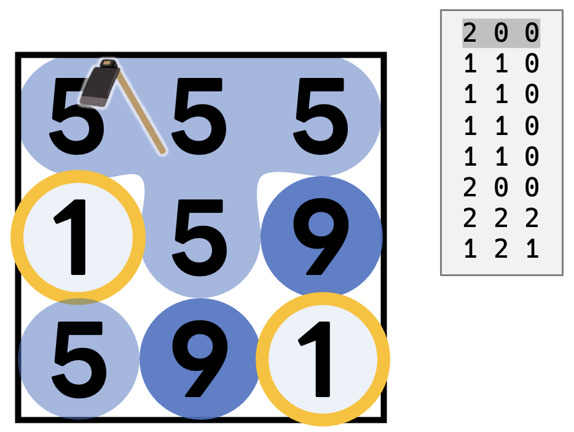

# 第3回 RCO日本橋ハーフマラソン 予選 B - ファーマーXの収穫計画 〜問題文読解編〜
- [第3回 RCO日本橋ハーフマラソン 予選 B - ファーマーXの収穫計画 〜問題文読解編〜](#第3回-rco日本橋ハーフマラソン-予選-b---ファーマーxの収穫計画-問題文読解編)
  - [問題文](#問題文)
      - [収穫の条件](#収穫の条件)
    - [入力例](#入力例)
    - [出力例](#出力例)
  - [正の得点を得る](#正の得点を得る)
  - [おわりに](#おわりに)

## 問題文

大きさが $N\times N$ マスの区画があり、区画の $i$ 行 $j$ 列目には品質が $A_{i, j}$ の野菜がある。以下の操作を最大 $M$ 回行って収穫する野菜の品質の合計値が大きくなるようにせよ。
- 操作1: 選んだ区画の野菜の品質を $1$ 増やす
- 操作2: 選んだ区画とその周辺から野菜を収穫する *(収穫の条件は後述)*  

#### 収穫の条件

選んだ区画の野菜の品質を $K$ とし、選んだ区画から「まだ収穫されていない品質 $K$ の野菜がある区画」だけを辿って上下左右に連結している区画の集合を $S$ とする。（ $S$ には選んだ区画自身を含む。） $S$ に含まれる区画の個数が $K$ 以上の場合 $S$ に含まれる区画の全ての野菜を収穫する。それ以外の場合は何もしない。


### 入力例
```
3 9
5 5 5
1 5 9
5 9 1
```
このケースは説明のため $N  = 3$ になっている。本番では $N = 50$ となることに注意。  

### 出力例

| 庭                                                                                                                                                                                                                                        | 得点 |
| ----------------------------------------------------------------------------------------------------------------------------------------------------------------------------------------------------------------------------------------- | ---- |
|                                                                                                                                                                                                        | 0    |
| `2 0 0`では、 $(0,0)$ から見た $S$ に含まれる区画は<br> $(0,0),(0,1),(0,2),(1,1)$ の 4つなので収穫できず、何も起きない。                                                                                                                  |      |
|                                                                                                                                                                                                        | 0    |
| 次の4回の操作（`1 1 0`を4回繰り返し）で $(1,0)$ にある野菜の品質を 1 から 5 に変更する。                                                                                                                                                  |      |
|                                                                                                                                                                                                        | 30   |
| すると、 $(0,0)$ から見た $S$ に含まれる区画は<br> $(0,0),(0,1),(0,2),(1,0),(1,1),(2,0)$ <br> $6$ つになるので、収穫できる条件を満たす。<br> $S$ に含まれる  $6$ つの区画のそれぞれから、品質  $5$ の野菜を収穫し、 $30$ 点の得点を得る。 |      |
|                                                                                                                                                                                                        | 31   |
| 次の操作（`2 2 2`）では、  $(2,2)$ にある野菜を収穫する。品質が  $1$ の野菜は単体で収穫することもできる。                                                                                                                                 |      |
|                                                                                                                                                                                                        | 31   |
| 最後の操作（`1 2 1`）では、 $(2,1)$ にある野菜の品質を $9$ から  $10$ に変更する。<br>入力で与えられる庭には 制約より $1$ 以上  $9$ 以下の品質の野菜しかないが、<br>**手入れ**をすることで $10$ 以上の品質の野菜を作ることもできる。      |      |


## 正の得点を得る
この記事の目標です。  
どのAHCでもまずは最初に**高い点数を得ようとせず、最小限の点数を得る**ことをオススメします。  
今回、入力すらうけとらずに得点を得ることができます！早速考えてみてください。
今回、収穫不能な区画を収穫しようとしても`WA`にはなりません。そして、品質が $1$ の野菜は単体でも収穫できます。ということは…

ainemの提出↓  
[python](https://atcoder.jp/contests/rco-contest-2019-qual/submissions/37918051)
[rust](https://atcoder.jp/contests/rco-contest-2019-qual/submissions/37918162)

## おわりに
いよいよ第三回皆解会が始まりました。今回の問題はAHCと違いテスターとビジュアライザがRustで提供されていません。次回はテスターの得点計算部分を解説できればなと思います。
少しだけ私も遊んでみましたが、アルゴリズム力をまったく使わなくても点数が増える面白い問題だと思います！めざせ[chokudaiさん](https://atcoder.jp/contests/rco-contest-2019-qual/submissions/4236425)超え！(本番613749	点)