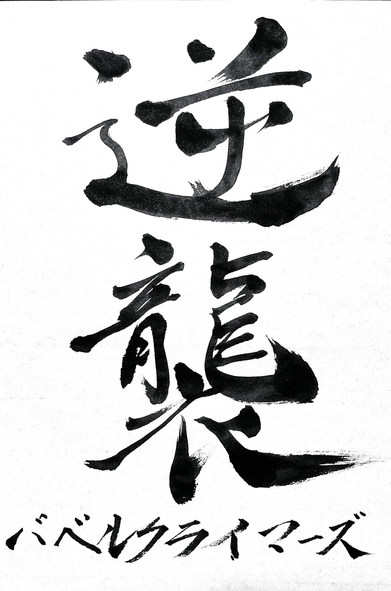
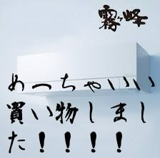
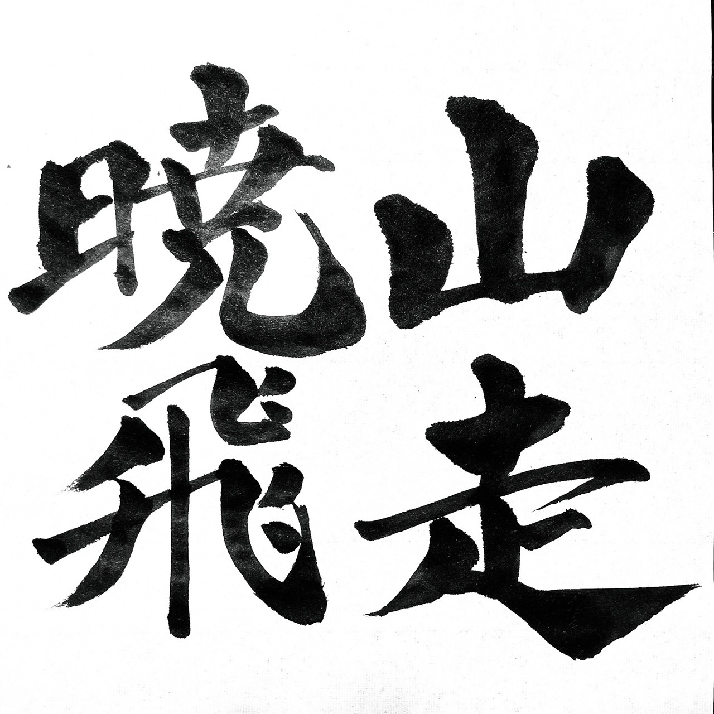

<strong>AHCやってみ隊</strong>

| ID                                                | name     | language |
| ------------------------------------------------- | -------- | -------- |
| [jamuojisan](https://atcoder.jp/users/jamuojisan) | maeda    | python   |
| [burioden](https://atcoder.jp/users/burioden)     | burioden | python   |
| [Claus](https://atcoder.jp/users/Claus)           | Claus    | python   |
| [gunmaneko](https://atcoder.jp/users/gunmaneko)   | aplaas   | cpp      |

<strong>逆襲のバベルクライマーズ</strong>

| ID                                                          | name            | language    |
| ----------------------------------------------------------- | --------------- | ----------- |
| [fujikawahiroaki](https://atcoder.jp/users/fujikawahiroaki) | fujikawahiroaki | crystal     |
| [motoshira](https://atcoder.jp/users/motoshira)             | motoshira       | common lisp |
| [kokatsu](https://atcoder.jp/users/kokatsu)                 | kokatsu         | D           |
| [yuuki_n](https://atcoder.jp/users/yuuki_n)                 | yuuki           | java        |

<strong>>euphonic</strong>

| ID                                                      | name                           | language    |
| ------------------------------------------------------- | ------------------------------ | ----------- |
| [uni_kakurenbo](https://atcoder.jp/users/uni_kakurenbo) | みどりむし(brthyjp)[A:緑/H:水] | cpp         |
| [Gex777](https://atcoder.jp/users/Gex777)               | スコテイ(Gex777)               | cpp         |
| [hiraku](https://atcoder.jp/users/hiraku)               | hiraku                         | python rust |
| [cplusplusonly](https://atcoder.jp/users/cplusplusonly) | cplusplusonly                  | cpp         |
| [otsuneko](https://atcoder.jp/users/otsuneko)           | otsuneko                       | rust python |

<strong>霧ヶ峰めっちゃ良い買い物しました！！！！</strong>

| ID                                                  | name       | language          |
| --------------------------------------------------- | ---------- | ----------------- |
| [michirakara](https://atcoder.jp/users/michirakara) | michirakra | python cpp cython |
| [zatt](https://atcoder.jp/users/zatt)               | zat        | rust              |
| [bio4eta](https://atcoder.jp/users/bio4eta)         | 4eta       | python cpp rust   |
| [hal0taso](https://atcoder.jp/users/hal0taso)       | __ukun     | cpp python        |
| [tnodino](https://atcoder.jp/users/tnodino)         | Natno      | python            |

<strong>benchmark</strong>

| ID                                                    | name     | language        |
| ----------------------------------------------------- | -------- | --------------- |
| [nephrologist](https://atcoder.jp/users/nephrologist) | ねふ     | rust cpp python |
| [utprg](https://atcoder.jp/users/utprg)               | ut       | python          |
| [r3yohei](https://atcoder.jp/users/r3yohei)           | ぱらぼろ | rust            |
| [brthyyjp](https://atcoder.jp/users/brthyyjp)         | brthyjp  | python          |

<strong>輝かしい未来を目指す不屈の戦い人</strong>

| ID                                            | name     | language   |
| --------------------------------------------- | -------- | ---------- |
| [akane831](https://atcoder.jp/users/akane831) | akane831 | cpp python |
| [keizin](https://atcoder.jp/users/keizin)     | keizin   | python     |
| [keroru](https://atcoder.jp/users/keroru)     | keroru   | python     |
| [jaku](https://atcoder.jp/users/jaku)         | jakusw   | python     |

<strong>山走暁飛</strong>

| ID                                                | name       | language   |
| ------------------------------------------------- | ---------- | ---------- |
| [nok0](https://atcoder.jp/users/nok0)             | nok0       | cpp python |
| [highjump](https://atcoder.jp/users/highjump)     | highjump   | cpp        |
| [milkcoffee](https://atcoder.jp/users/milkcoffee) | milkcoffee | cpp        |
| [8wings](https://atcoder.jp/users/8wings)         | 8wings     | python     |
